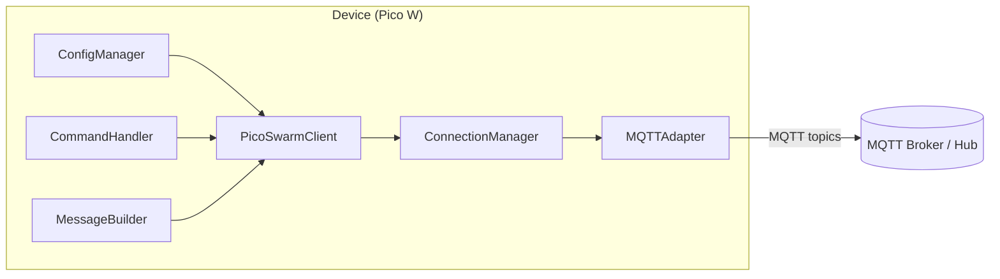
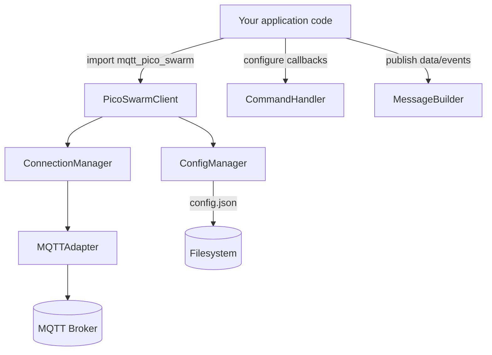

# MQTT Pico Swarm

> Lightweight MQTT orchestration for Raspberry Pi Pico W devices running MicroPython.

[](LICENSE)
[](https://micropython.org/)
[](https://www.raspberrypi.com/products/raspberry-pi-pico/)

## Overview

**MQTT Pico Swarm** provides the client-side building blocks for Pico W nodes that talk to an MQTT hub. The library focuses on MQTT only—WiFi handling lives in your own bootstrap code—so you can reuse the same components on the hub, in simulations, and during desktop testing.



*Figure 1: Modulernas ansvar och hur data flödar från klienten till MQTT-hubben.*

Key goals:

- Keep the public API tiny and predictable.
- Stay below a 25 KB runtime footprint on MicroPython.
- Use `umqtt.robust2` as the single MQTT dependency.
- Offer parity between MicroPython and desktop (CPython) test environments.

## Highlights

- **Straightforward API** – connect, publish data/events, send heartbeats, and handle commands with a few method calls.
- **Resilient connections** – exponential backoff (5 → 60 s) and detailed error reporting via `ConnectionManager`.
- **Configurable behaviour** – JSON config files managed by `ConfigManager`, including validation and safe updates.
- **Protocol compliance** – topic helpers and payload builders ensure messages match the documented contract in [docs/PROTOCOL.md](docs/PROTOCOL.md).
- **Command routing** – `CommandHandler` supports type-specific callbacks plus wildcards for fleet-wide actions.
- **Ready-to-run example** – `examples/internal-temp-sensor/main.py` demonstrates WiFi setup, MQTT lifecycle, command handling, real temperature telemetry, and optional time synchronisation via broadcast.

## What's inside

| Module | Responsibility |
| --- | --- |
| `client.py` | High-level `PicoSwarmClient` orchestrating config, MQTT, messages, and command callbacks. |
| `connection.py` | Reconnection strategy, last-will configuration, and message pump utilities. |
| `mqtt.py` | Thin wrapper around `umqtt.robust2.MQTTClient` with consistent error surfaces. |
| `messages.py` | Payload builders for status, data, events, command acknowledgements, and heartbeats. |
| `commands.py` | Registration/dispatch of command callbacks with wildcard support. |
| `config.py` | JSON config loading, validation, and persistence with safe defaults. |
| `constants.py`, `errors.py`, `utils.py` | Protocol constants, exception hierarchy, and MicroPython-friendly helpers. |

## Getting started



*Figure 2: Så kopplar du in biblioteket i din egen applikation.*

### Desktop development workflow

1. Clone the repo and install Python ≥3.9.
2. (Optional) Create a virtual environment.
3. Run the unit test suite:

   ```bash
   python -m unittest discover
   ```

   The desktop tests use fakes/mocks so they run without MicroPython tooling.

### Deploying to a Pico W

1. Flash MicroPython 1.21+ to the board (see the [official guide](https://micropython.org/download/rp2-pico-w/)).
2. Install the library via `mpremote mip` (requires network access on the Pico W):

   ```bash
   mpremote mip install https://it-huset.github.io/mqtt-pico-swarm/mqtt-pico-swarm.json
   ```

   Alla moduler placeras automatiskt under `/lib/mqtt_pico_swarm` och ersätts vid uppgraderingar.
3. (Optional) Installera demo och `umqtt.robust2` med helper-scriptet:

   ```bash
   python scripts/deploy_demo.py --port auto --install-umqtt --skip-library
   ```

   - Scriptet hoppar över biblioteket (som redan installerats via `mip`) men kopierar demo-koden och installerar `micropython-umqtt.simple2` under `/lib/umqtt`.
4. Verifiera versionen i REPL:

   ```bash
   mpremote connect auto repl
   ```

   ```python
   >>> import mqtt_pico_swarm
   >>> mqtt_pico_swarm.__version__
   '1.1.1-SNAPSHOT'
   ```

5. Kopiera `examples/internal-temp-sensor/config.json.example` till boarden (`config.json`) och uppdatera broker-kredentialer.
6. Lägg in WiFi-kredentialer i ditt bootstrap-script innan du kör exemplet.

```python
import network


def connect_wifi(ssid, password, timeout=15):
    wlan = network.WLAN(network.STA_IF)
    if not wlan.isconnected():
        wlan.active(True)
        wlan.connect(ssid, password)
        while not wlan.isconnected() and timeout > 0:
            time.sleep(1)
            timeout -= 1
    if not wlan.isconnected():
        raise RuntimeError("WiFi connection failed")
    return wlan.ifconfig()
```

> ℹ️ The basic demo reads the Pico W CPU’s internal temperature sensor (`machine.ADC(4)`) once per minute. Use the `TEMPERATURE_CALIBRATION_OFFSET` constant in the example to align readings with an external thermometer if needed.

### Minimal usage example

```python
import time
from mqtt_pico_swarm import PicoSwarmClient

connect_wifi("YourWiFiSSID", "YourWiFiPassword")

client = PicoSwarmClient(config_file="config.json", debug=True)
client.connect()

@client.on_command("action")
def handle_action(command):
    print("received", command)
    client.acknowledge_command(command["command_id"], "success", message="Handled")

client.publish_data("DHT22", {"temperature": 22.5, "humidity": 65.3}, unit="°C")
client.send_heartbeat()
```

See [examples/internal-temp-sensor/main.py](examples/internal-temp-sensor/main.py) for a full loop that connects WiFi, streams the Pico W’s internal temperature sensor, sends heartbeats, and acknowledges commands.

## Distributing via `mpremote mip`

We host ready-to-install builds on GitHub Pages so devices can install the library with a single command.

### Install on a Pico W

```bash
mpremote mip install https://it-huset.github.io/mqtt-pico-swarm/mqtt-pico-swarm.json
```

Manifestet använder `urls`-formatet som MicroPython dokumenterar och placerar varje modul under `/lib/mqtt_pico_swarm`. Kör samma kommando igen när en ny release publicerats för att uppgradera in-place.

### Regenerate package artefacts locally

Use the helper script to stage files and refresh the manifest/index in one go before publishing:

```bash
python scripts/prepare_mip_package.py
```

Key options:

- `--mpy-cross PATH` – compile staged modules to `.mpy` (use `--keep-py` to retain `.py`).
- `--skip-stage` / `--skip-manifest` – run only half of the pipeline when you already have staged files or just need to rebuild the manifest.
- `--no-index` – skip generating `index.json` if you only need the manifest file.

Utdata landar i `build/mip/` (manifest i `mqtt-pico-swarm.json`, index i `index.json`, bibliotek i `lib/`). När du är nöjd triggar du workflowet `Publish mip package` ( `.github/workflows/publish-mip.yml`) för att lägga upp artefakterna på GitHub Pages. Efter deploy går det att installera via `mpremote mip` som beskrivet ovan.

> **Obs:** Manifestet måste publiceras på en statisk webbplats (GitHub Pages) och `mpremote` kräver att Pico W är uppkopplad mot internet. Om installationen misslyckas, kontrollera nätverket och att manifestet är åtkomligt via `curl`.

## Configuration

`ConfigManager` merges `config.json` with sane defaults and validates every field. Required sections:

- `device_id` *(string)* – unique per node.
- `device_type` *(string)* – human readable classification.
- `mqtt` *(object)* – at minimum `broker`, optional `port`, `client_id`, `username`, `password`, `keepalive`.
- Behaviour tuning: `heartbeat_interval`, `reconnect_delay`, `max_reconnect_attempts`, `command_ack_timeout`.

Example configuration:

```json
{
  "device_id": "pico-001",
  "device_type": "temperature_sensor",
  "firmware_version": "1.0.0",
  "mqtt": {
    "broker": "192.168.1.100",
    "port": 1883,
    "keepalive": 60,
    "client_id": "pico-001",
    "username": "",
    "password": ""
  },
  "heartbeat_interval": 60,
  "reconnect_delay": 5,
  "max_reconnect_attempts": 10,
  "command_ack_timeout": 30
}
```

⚠️ WiFi credentials are intentionally **not** part of the config file—handle them alongside your bootstrap code so credentials never ship with the library.

## Runtime behaviour

1. **connect()**
   - Loads and validates configuration.
   - Configures an MQTT last will (offline status message).
   - Subscribes to command topics and publishes an `online` status payload.
2. **publish_data / publish_event / acknowledge_command**
   - Build JSON payloads via `MessageBuilder` and publish with the configured QoS/retain strategy.
3. **send_heartbeat() / start()**
   - Publish uptime, free memory, and accumulated command errors.
   - `start()` calls `ensure_connected()` in a loop and reacts to adapter errors without crashing the device loop.
4. **Command handling**
   - Topic-to-callback routing with wildcard option; exceptions increment an internal error counter to surface issues.

## Testing & quality

- `python -m unittest discover` currently runs **48 tests** covering happy paths and a wide range of negative scenarios (reconnect failures, malformed payloads, corrupt configs, etc.).
- Desktop tests rely on pure-Python fakes so contributors can validate changes without MicroPython hardware.

## Project layout

```text
├── docs/
│   ├── API.md
│   ├── ARCHITECTURE.md
│   ├── PROTOCOL.md
│   └── SETUP.md
├── examples/
│   └── basic/
│       ├── config.json.example
│       └── main.py
├── src/
│   └── mqtt_pico_swarm/
│       ├── __init__.py
│       ├── client.py
│       ├── commands.py
│       ├── config.py
│       ├── connection.py
│       ├── constants.py
│       ├── errors.py
│       ├── messages.py
│       ├── mqtt.py
│       └── utils.py
├── tests/
│   ├── test_client.py
│   ├── test_commands.py
│   ├── test_config.py
│   ├── test_connection.py
│   ├── test_messages.py
│   └── test_mqtt_adapter.py
├── CHANGELOG.md
├── LICENSE
└── README.md
```

## Documentation & support

- Protocol and architecture notes live in [docs/](docs/).
- Raise questions or issues via the issue tracker of your upstream repository.

## License

Released under the MIT License. See [LICENSE](LICENSE) for full text.

---

Built with robustness in mind for fleets of Pico W devices. Happy swarming! 😄
