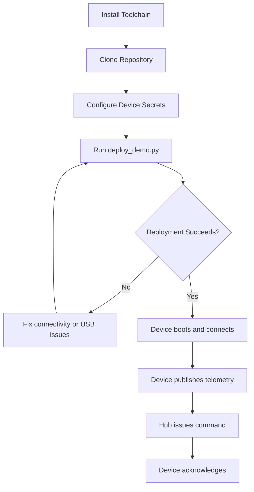
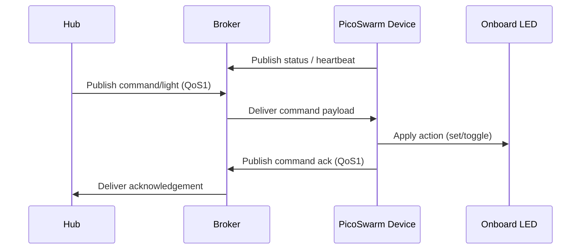

# MQTT Pico Swarm Integration Guide

**Version:** 1.0  
**Last updated:** November 16, 2025

Welcome to the official integration guide for the MQTT Pico Swarm library. This document is written for developers who want to bring Raspberry Pi Pico W devices online quickly, reliably, and in a way that scales from a single prototype to a managed swarm of devices. The guide assumes limited prior experience with MicroPython, MQTT, or embedded development and will walk you from environment setup to a fully integrated device that reports telemetry, handles commands, and acknowledges actions back to the hub.

This guide is intentionally comprehensive (≈2000–4000 words) to eliminate guesswork. Each section explains **what** to do, **why** it matters, and **how** to adapt the patterns to your own project. If you follow the steps in order, you should be able to onboard a new developer and deliver a working Pico device in 30–45 minutes.

---

## Table of Contents

- [MQTT Pico Swarm Integration Guide](#mqtt-pico-swarm-integration-guide)
  - [Table of Contents](#table-of-contents)
  - [Quick Start (TL;DR)](#quick-start-tldr)
  - [What the Library Provides vs. What You Implement](#what-the-library-provides-vs-what-you-implement)
  - [Already Have a Working Pico Project?](#already-have-a-working-pico-project)
  - [Getting Started](#getting-started)
    - [Prerequisites](#prerequisites)
    - [Install the Toolchain](#install-the-toolchain)
    - [Clone and Verify the Repository](#clone-and-verify-the-repository)
    - [Prepare the Pico W](#prepare-the-pico-w)
    - [Understand the Provisioning Flow](#understand-the-provisioning-flow)
  - [System Architecture Summary](#system-architecture-summary)
    - [Component Overview](#component-overview)
    - [Runtime Interactions](#runtime-interactions)
  - [Development Environment Setup](#development-environment-setup)
    - [Python Environment](#python-environment)
    - [Configuring Secrets and WiFi Credentials](#configuring-secrets-and-wifi-credentials)
    - [Broker Connectivity Checklist](#broker-connectivity-checklist)
  - [End-to-End Tutorial](#end-to-end-tutorial)
    - [Step 1: Create a Configuration](#step-1-create-a-configuration)
    - [Step 2: Inspect the Example Application](#step-2-inspect-the-example-application)
    - [Step 3: Deploy to the Pico W](#step-3-deploy-to-the-pico-w)
    - [Step 4: Exercise the LED Command](#step-4-exercise-the-led-command)
    - [Step 5: Integrate Your Existing Code](#step-5-integrate-your-existing-code)
      - [5.1 Identify Integration Points](#51-identify-integration-points)
      - [5.2 Minimal Integration Pattern](#52-minimal-integration-pattern)
      - [5.3 Add Remote Control (Optional)](#53-add-remote-control-optional)
      - [5.4 Full Before/After Comparison](#54-full-beforeafter-comparison)
      - [Bonus: Extending with Additional Sensors](#bonus-extending-with-additional-sensors)
  - [API Reference](#api-reference)
    - [High-Level Client API](#high-level-client-api)
    - [Command Handling](#command-handling)
    - [Message Building](#message-building)
    - [Command ID Format](#command-id-format)
    - [Constants and Topics](#constants-and-topics)
  - [Common Integration Patterns](#common-integration-patterns)
    - [Timed Telemetry Publishing](#timed-telemetry-publishing)
    - [Command Acknowledgement Workflow](#command-acknowledgement-workflow)
    - [Graceful Degradation on Unsupported Parameters](#graceful-degradation-on-unsupported-parameters)
    - [Broadcast Handling and Time Sync](#broadcast-handling-and-time-sync)
  - [Troubleshooting Guide](#troubleshooting-guide)
    - [Common Mistakes to Avoid](#common-mistakes-to-avoid)
  - [File Structure Reference](#file-structure-reference)
    - [Your Project Structure](#your-project-structure)
  - [Example Project Gallery](#example-project-gallery)
  - [Glossary and Next Steps](#glossary-and-next-steps)
    - [Where to Go Next](#where-to-go-next)

---

## Quick Start (TL;DR)

✓ Flash MicroPython to the Pico W  
✓ Clone repository and install Python tools  
✓ Edit `config.json` with WiFi + MQTT credentials  
✓ Run `python scripts/deploy_demo.py --reset`  
✓ Send test command: `mosquitto_pub -t hub/devices/.../commands/light ...`  
✓ Time to working device: ~15 minutes

## What the Library Provides vs. What You Implement

| Library provides | You implement |
| --- | --- |
| MQTT connection management and reconnection | Sensor reading logic |
| Command routing & acknowledgement helpers | Hardware-specific actuator control |
| Telemetry publishing helpers | Business/domain logic (e.g., temperature thresholds) |
| Status & heartbeat publishing | When to publish (timing, batching) |
| WiFi credentials loading & retries | Error handling and fallback strategies |

## Already Have a Working Pico Project?

If you already have sensor or actuator code running on a Pico:

1. Keep your existing modules untouched (e.g., `my_sensor.py`, `my_leds.py`).
2. Create a new `main.py` that imports those modules.
3. Instantiate `PicoSwarmClient` and call `connect()` once.
4. Wrap your main loop with `publish_sensor_data()` and `process_incoming_commands()`.
5. (Optional) Register command handlers to expose remote control.

Your application logic stays the same—you are only adding networking capabilities.

## Getting Started

This chapter makes sure your workstation, Pico firmware, and MQTT infrastructure are ready. If something fails later, return here and confirm every prerequisite is met.

### Prerequisites

| Requirement | Why it matters | How to verify |
| --- | --- | --- |
| macOS, Linux, or Windows workstation | Provides the tooling required for MicroPython flashing and deployment. | `python3 --version` and `git --version` should succeed. |
| Python 3.10+ | Matches the tooling requirements in `requirements.txt` and ensures compatibility with the scripts. | Run `python3 --version` and confirm ≥ 3.10. |
| USB A-to-Micro-B cable (data capable) | Required for flashing firmware and deploying files via `mpremote`. | Ensure the Pico W appears as a serial device when plugged in. |
| WiFi network credentials | The Pico W must join your network to reach the MQTT broker. | Confirm SSID/password are correct and allow 2.4 GHz devices. |
| MQTT broker (e.g., Mosquitto) | Central hub for device communication. | `mosquitto_pub` and `mosquitto_sub` should connect successfully. |

### Install the Toolchain

Install the Python dependencies and CLI tools used throughout this guide:

```bash
python3 -m venv .venv
source .venv/bin/activate
pip install --upgrade pip
pip install -r requirements.txt
mpremote --help
```

**Why:** The virtual environment isolates dependencies (notably `mpremote`, `pyserial`, and unit test tooling) so that system-wide packages do not interfere with Pico deployment scripts.

### Clone and Verify the Repository

```bash
git clone https://github.com/IT-HUSET/mqtt-pico-swarm.git
cd mqtt-pico-swarm
git status
pytest
```

**Why:** Running the tests before you start gives you a known-good baseline. If any test fails at this stage, resolve it before modifying the code so you do not chase false positives later.

### Prepare the Pico W

1. **Flash MicroPython** (only required once per board):

   ```bash
   wget https://micropython.org/resources/firmware/RPI_PICO_W-20240222-v1.22.0.uf2
   # Hold BOOTSEL while plugging in the Pico, copy the UF2 to the mounted drive.
   ```

2. **Install the MQTT client dependency** on the board if you are not using the deployment script:

   ```bash
   mpremote connect auto mip install micropython-umqtt.simple2
   ```

3. **Validate the REPL**:

   ```python
   mpremote connect auto
   >>> import network
   >>> exit()
   ```

**Why:** Confirming a clean firmware and `umqtt.simple2` installation removes a large class of runtime failures (missing modules, incompatible firmware).

### Understand the Provisioning Flow

The following flowchart summarises how the library, scripts, and infrastructure interact from developer setup to an operational device:



**Key insight:** Deployment is iterative. If deployment fails, address connectivity problems first (USB cable, mpremote access, WiFi credentials) before debugging firmware or application logic.

---

## System Architecture Summary

### Component Overview

The MQTT Pico Swarm stack is structured to separate concerns and keep device firmware maintainable:

- **Application Code (examples or your own project):** Contains sensor logic, command handlers, and device-specific behaviour. Lives in `examples/` or your custom module.
- **PicoSwarmClient:** High-level API encapsulating connection management, telemetry publishing, and command acknowledgement.
- **CommandHandler:** Routes command payloads based on MQTT topics to the correct callback, including the new `light` command.
- **ConnectionManager:** Keeps the MQTT connection alive, handles reconnects, and forwards incoming messages.
- **MQTTAdapter:** Thin wrapper around `umqtt.simple2`, normalising publish/subscribe behaviour and handling differences between MicroPython releases.
- **MessageBuilder:** Generates protocol-compliant JSON payloads for status, telemetry, events, and command acknowledgements.
- **Constants and Utilities:** Centralised topic templates, QoS levels, retain flags, and helper functions.

### Runtime Interactions

The runtime responsibilities are easiest to understand using a sequence diagram of the light command flow:



**Why it matters:** When you understand the message flow, you can reason about failure modes. For example, if the hub never receives an acknowledgement, trace the arrows backwards: did the Pico publish the ack? Did the broker deliver it? Did the hub subscribe to the ack topic?

---

## Development Environment Setup

### Python Environment

If you skipped the virtual environment earlier, set it up now. Running all scripts through `python -m` ensures the correct interpreter is used:

```bash
source .venv/bin/activate
python -m pip install -r requirements.txt
python -m unittest
```

**Why:** The deployment scripts rely on packages such as `click` and `requests`. Running them with mismatched Python versions can lead to subtle encoding issues when copying files to the Pico filesystem.

### Configuring Secrets and WiFi Credentials

The library expects WiFi and MQTT settings to be available at runtime. In the example application, they live in `examples/internal-temp-sensor/config.json`. Adjust the template to match your infrastructure:

```json
{
  "wifi": {
    "ssid": "YourWifi",
    "password": "super-secret-passphrase"
  },
  "mqtt": {
    "host": "192.168.1.10",
    "port": 1883,
    "username": "pico-swarm",
    "password": "pico-password",
    "client_id": "pico-lab-001"
  },
  "device": {
    "device_id": "pico-lab-001",
    "location": "Lab Bench"
  }
}
```

Add the file to your `.gitignore` if you customise it with secrets you do not want committed.

**Why:** Keeping configuration out of code lets you deploy the same firmware binary to multiple devices with only configuration changes applied at deployment time.

### Broker Connectivity Checklist

Before deploying the Pico, confirm that the workstation can reach the broker using the same credentials:

```bash
mosquitto_pub -h 192.168.1.10 -u pico-swarm -P pico-password -t "test/topic" -m "ping"
mosquitto_sub -h 192.168.1.10 -u pico-swarm -P pico-password -t "test/topic" -C 1
```

**Why:** If these commands fail, the Pico will fail too. Fix firewall rules or credentials now and avoid late-night debugging on constrained hardware.

---

## End-to-End Tutorial

This chapter walks through creating a configuration, deploying the example, sending an LED command, and extending the example with a custom sensor. The steps build on each other; complete them in order.

### Step 1: Create a Configuration

Copy the template and edit the values for your environment:

```bash
cp examples/internal-temp-sensor/config.template.json examples/internal-temp-sensor/config.json
```

Open `config.json` and modify the WiFi and MQTT credentials to match the ones verified earlier. Double-check the `device_id`; it is used in topic construction and must be unique per device.

**Why:** A misconfigured device ID will lead to clashing MQTT topics when you deploy multiple devices, causing incorrect command routing and telemetry attribution.

### Step 2: Inspect the Example Application

Familiarise yourself with `examples/internal-temp-sensor/main.py`. The following excerpt highlights the sections you will touch during customisation:

```python
"""Example application for MQTT Pico Swarm."""
import time
import machine

from mqtt_pico_swarm import PicoSwarmClient
from mqtt_pico_swarm.constants import COMMAND_TYPE_LIGHT

client = PicoSwarmClient.from_config_file("config.json")

@client.on_command(COMMAND_TYPE_LIGHT)
def handle_light_command(command):
    """Respond to LED set/toggle actions from the hub."""
    action = (command.get("action") or "set").lower()
    state = (command.get("state") or "off").lower()
    if action == "toggle":
        client.toggle_led()
        client.acknowledge_command(command["command_id"], "success")
        return
    if action == "set":
        client.set_led(state == "on")
        client.acknowledge_command(command["command_id"], "success")
        return
    client.acknowledge_command(command["command_id"], "failed", message="Unsupported action")

while True:
    temperature = client.read_internal_temperature_c()
    client.publish_sensor_data({"temperature_c": temperature})
    client.process_incoming_commands(timeout_ms=250)
    time.sleep(5)
```

**Why:** Reading the example before making changes prevents accidental regressions. You should recognise the command handler registration, telemetry loop, and acknowledgement logic before implementing your own behaviour.

### Step 3: Deploy to the Pico W

Use the helper script to upload the example application, dependencies, and configuration in one step:

```bash
python scripts/deploy_demo.py \
  --port auto \
  --project examples/internal-temp-sensor \
  --config examples/internal-temp-sensor/config.json \
  --reset
```

- `--port auto` asks `mpremote` to find the Pico.
- `--project` selects the source directory to upload.
- `--config` copies your customised configuration alongside the code.
- `--reset` issues a soft reset after deployment so the code starts immediately.

Monitor the terminal for `[Example]` log lines. A successful boot looks like:

```text
[Example] Connecting to WiFi...
[Example] Connected to MQTT broker at 192.168.1.10:1883
[Example] Published temperature reading: 23.4 °C
```

**Why:** Automating deployment ensures repeatability. Manual copying with `mpremote fs cp` is prone to missing files (e.g., forgetting the `lib/` folder) and increases onboarding time for new developers.

### Step 4: Exercise the LED Command

With the device online, publish a light command from your workstation (replace the topic with your device ID):

```bash
mosquitto_pub \
  -h 192.168.1.10 \
  -u pico-swarm \
  -P pico-password \
  -t "hub/devices/pico-lab-001/commands/light" \
  -m '{"commandId":"cmd-1","action":"toggle"}' \
  -q 1
```

Then observe the acknowledgement:

```bash
mosquitto_sub \
  -h 192.168.1.10 \
  -u pico-swarm \
  -P pico-password \
  -t "hub/devices/pico-lab-001/commands/ack" \
  -v
```

Expected payload:

```json
{
  "command_id": "cmd-1",
  "status": "success",
  "result": {
    "current_state": "on"
  }
}
```

**Why:** Verifying both the command and the acknowledgement confirms that your command handler, LED abstraction, and command ID propagation work end-to-end.

### Step 5: Integrate Your Existing Code

Most developers already have sensor and actuator code. The goal is to wrap that code with MQTT features without rewriting it.

#### 5.1 Identify Integration Points

Look at your existing loop and note where you:

- Read sensors
- Update actuators (LEDs, relays, etc.)
- Wait or sleep

These are the places where you will insert MQTT calls.

#### 5.2 Minimal Integration Pattern

**Before integrating MQTT:**

```python
import time
from my_sensor import read_temperature
from my_leds import update_leds

while True:
    temp = read_temperature()
    update_leds(temp)
    print("Temp:", temp)
    time.sleep(5)
```

**After integrating MQTT (core changes highlighted):**

```python
import time
from my_sensor import read_temperature
from my_leds import update_leds
from mqtt_pico_swarm import PicoSwarmClient  # ✅ Added

client = PicoSwarmClient.from_config_file("config.json")  # ✅ Added
client.connect()  # ✅ Added once before the loop

@client.on_command("light")  # ✅ Optional remote control hook
def remote_led_control(cmd):
    if cmd.get("action") == "set":
        update_leds(manual_override=cmd.get("state") == "on")
    client.acknowledge_command(cmd.get("command_id"), "success")

while True:
    temp = read_temperature()
    update_leds(temp)

    client.publish_sensor_data({"temperature": temp})  # ✅ Added
    client.process_incoming_commands(timeout_ms=100)  # ✅ Added

    time.sleep(5)
```

**Key insight:** Your sensor and LED code stays untouched. You only add MQTT-specific calls around it.

#### 5.3 Add Remote Control (Optional)

- Use `@client.on_command("your-command")` to register handlers.
- Use `client.acknowledge_command()` to confirm success or failure.
- Keep handlers short; move slow operations to the main loop if possible.

#### 5.4 Full Before/After Comparison

| Aspect | Before MQTT | After MQTT |
| --- | --- | --- |
| Sensor logic | `read_temperature()` | Same function call |
| Actuator logic | `update_leds(temp)` | Same function call |
| Networking | `print()` only | `client.publish_sensor_data()` |
| Remote control | Not available | Optional command handler |
| Error reporting | Serial console | Structured acknowledgements |

Once you validate the integration on one device, apply the same wrapper to other projects. The only parts that change are your domain-specific modules.

#### Bonus: Extending with Additional Sensors

When you are ready to add more sensors, reuse this pattern by importing additional modules and appending fields to the payload before publishing. The MQTT integration code remains identical.

---

## API Reference

This section condenses the most relevant API calls so you can code without reading the source files. Refer back to it as you implement your own application layer.

### High-Level Client API

| Method | Description | Notes |
| --- | --- | --- |
| `PicoSwarmClient.from_config_file(path)` | Factory method that loads configuration, initialises MQTT components, and returns a ready-to-use client. | Use this in `main.py` to keep configuration data separate from code. |
| `connect()` | Establishes WiFi and MQTT connections, publishes the "online" status, and starts the heartbeat timer. | Idempotent; safe to call multiple times. Raises `ConnectionError` on failure. |
| `disconnect()` | Gracefully closes the MQTT connection and marks the device offline. | Publishes a last-will status if configured. |
| `publish_sensor_data(payload, qos=None)` | Publishes structured telemetry data to the hub. | Accepts `dict` payloads; serialisation handled internally. |
| `publish_event(event_type, message, severity="info")` | Emits event messages for diagnostics or alerts. | Use for non-telemetry, human-readable notifications. |
| `acknowledge_command(command_id, status, message="", result=None)` | Sends command acknowledgements with result metadata. | Must be called if the command included a `commandId`. |
| `process_incoming_commands(timeout_ms=0)` | Polls the MQTT connection for incoming messages and dispatches commands. | Call this frequently inside your main loop. |
| `toggle_led()` / `set_led(state)` / `led_state` | Helper methods added in the example application for LED control. | Provided for convenience; feel free to replace with your own hardware abstraction. |
| `send_heartbeat(now=None)` | Forces an immediate heartbeat publish. | Useful for diagnostics or when implementing manual watchdogs. |

### Command Handling

| API | Usage |
| --- | --- |
| `@client.on_command(command_type)` | Decorator to register callbacks for specific command types (e.g., `COMMAND_TYPE_LIGHT`). |
| `client.on_any_command(callback)` | Catch-all handler for commands without a dedicated callback. Useful for logging or metrics. |
| Callback signature | `def handler(payload: dict) -> bool` returning `True` if handled. |
| Error propagation | Unhandled exceptions inside callbacks are caught and reported via acknowledgement with status `failed`. |

### Message Building

`MessageBuilder` is used internally, but understanding its outputs helps when inspecting MQTT payloads:

- `status(online: bool)` → `{ "status": "online" | "offline", "ts": <epoch_ms> }`
- `heartbeat(uptime_seconds, memory_free, error_count)` → Keep-alive message consumed by the hub.
- `sensor(device_id, payload)` → Wraps sensor data with metadata (device ID, timestamp).
- `command_ack(command_id, status, message, result)` → Sent by `acknowledge_command`.

**Why it matters:** If you implement custom publishers (e.g., for batch uploads), reuse `MessageBuilder` so your messages stay protocol-compliant.

### Command ID Format

Commands from the hub include a `command_id` field (snake_case when accessed from Python dictionaries). Always echo the same ID when acknowledging:

- Incoming: `{ "command_id": "cmd-123", "action": "set" }`
- Outgoing: `{ "command_id": "cmd-123", "status": "success", ... }`

This one-to-one mapping lets the hub correlate requests and responses reliably.

### Constants and Topics

Key constants exported from `mqtt_pico_swarm.constants`:

| Constant | Value | Purpose |
| --- | --- | --- |
| `COMMAND_TYPE_LIGHT` | `"light"` | MQTT topic suffix for light commands. |
| `COMMAND_TYPE_ACTION` | `"action"` | Generic device action commands. |
| `QOS_COMMAND_LIGHT` | `1` | QoS requirement for `light` command subscription. |
| `device_command_topic(device_id, command_type)` | | Helper to compute `hub/devices/{device_id}/commands/{type}`. |
| `device_ack_topic(device_id)` | | Helper for `hub/devices/{device_id}/commands/ack`. |

**Best practice:** Always use the helper functions to compose topics. Hard-coded strings drift over time and break when protocol updates land.

---

## Common Integration Patterns

### Timed Telemetry Publishing

This pattern uses a non-blocking loop with periodic telemetry and command polling. It is suitable for most sensor devices:

```python
import time
from mqtt_pico_swarm import PicoSwarmClient

PUBLISH_INTERVAL = 10
client = PicoSwarmClient.from_config_file("config.json")
client.connect()
last_publish = 0

while True:
    now = time.time()
    if now - last_publish >= PUBLISH_INTERVAL:
        sensor_payload = {
            "temperature_c": client.read_internal_temperature_c(),
            "uptime_seconds": int(now - client.connected_since),
        }
        client.publish_sensor_data(sensor_payload)
        last_publish = now
    client.process_incoming_commands(timeout_ms=100)
```

**Why:** Separating the telemetry timer from command processing prevents the device from becoming unresponsive when no sensor update is due. It also allows you to tighten the command polling interval without flooding the broker with telemetry.

### Command Acknowledgement Workflow

Explicitly acknowledging commands—even failures—improves operational visibility. The following example surfaces error details to the hub:

```python
from mqtt_pico_swarm.constants import COMMAND_TYPE_ACTION

@client.on_command(COMMAND_TYPE_ACTION)
def handle_action(payload):
    command_id = payload.get("commandId") or payload.get("command_id")
    try:
        perform_action(payload)
    except RuntimeError as error:
        if command_id:
            client.acknowledge_command(
                command_id,
                "failed",
                message=str(error),
                result={"retryable": False},
            )
        return False

    if command_id:
        client.acknowledge_command(
            command_id,
            "success",
            result={"performed": True},
        )
    return True
```

**Why:** Providing structured failure metadata allows the hub to decide whether to retry automatically or alert an operator.

### Graceful Degradation on Unsupported Parameters

When commands include fields the device cannot honour (e.g., `brightness` for a simple on/off LED), acknowledge the limitation instead of silently dropping the information.

**Without Graceful Degradation:**

- Hub sends: `{ "action": "set", "state": "on", "brightness": 50 }`
- Device: Crashes or ignores `brightness`
- Result: Hub cannot tell what happened ❌

**With Graceful Degradation:**

- Hub sends: `{ "action": "set", "state": "on", "brightness": 50 }`
- Device: Turns on LED, acknowledges with `{ "current_state": "on", "brightness_support": "false" }`
- Result: Hub updates UI accurately and can hide brightness controls ✓

Implementation example:

```python
SUPPORTED_ACTIONS = {"set", "toggle"}
SUPPORTED_STATES = {"on", "off"}

@client.on_command(COMMAND_TYPE_LIGHT)
def handle_light(payload):
    command_id = payload.get("commandId") or payload.get("command_id")
    action = (payload.get("action") or "set").lower()
    state = (payload.get("state") or "off").lower()
    brightness = payload.get("brightness")

    if action not in SUPPORTED_ACTIONS:
        client.acknowledge_command(command_id, "failed", message="Unsupported action")
        return False

    if action == "set" and state not in SUPPORTED_STATES:
        client.acknowledge_command(command_id, "failed", message="Unsupported state")
        return False

    client.set_led(state == "on" if action == "set" else not client.led_state)

    result = {"current_state": "on" if client.led_state else "off"}
    if brightness is not None:
        result["brightness_support"] = False
    client.acknowledge_command(command_id, "success", result=result)
    return True
```

**Why:** Explicit communication of unsupported parameters keeps the hub team aligned with device capabilities.

### Broadcast Handling and Time Sync

The library supports broadcast messages (e.g., time synchronisation) published on `hub/broadcast`. Use the wildcard handler when you need global behaviour changes:

```python
@client.on_broadcast
def handle_broadcast(topic, payload):
    message_type = payload.get("type")
    if message_type == "time-sync":
        client.update_rtc(payload["epoch_ms"])  # device-specific helper
    elif message_type == "log-level":
        client.set_log_level(payload.get("level", "info"))
```

**Why:** Broadcast messages let you change behaviour across the fleet without redeploying code. Handling them cleanly avoids duplicating logic in each device-specific command handler.

---

## Troubleshooting Guide

| Symptom | Likely Cause | Resolution |
| --- | --- | --- |
| `mpremote` cannot find the device | USB cable is power-only, or another process is holding the serial port. | Use a known good data cable, run `lsof /dev/tty.usbmodem*`, and close conflicting terminals. |
| Device logs `Failed to connect to WiFi` | Incorrect SSID/password or 5 GHz network. | Double-check credentials, ensure the access point exposes a 2.4 GHz network. |
| No telemetry appears on the broker | MQTT credentials wrong or broker unreachable. | Re-run the broker connectivity checklist, verify firewall rules, confirm broker IP. |
| Command acknowledgement missing | Command handler raised an exception before `acknowledge_command`. | Wrap handler logic in try/except, log errors, and send `failed` acknowledgements. |
| `MemoryError` during deployment | Files exceed Pico filesystem capacity. | Remove unused examples, compress assets, or use frozen modules. |
| `ValueError: Device has no controllable LED` | Pico variant lacks onboard LED alias. | Wire an external LED to a known GPIO and adjust `machine.Pin` configuration. |
| Broker receives malformed JSON | Manual publishes omitted quotes or used single quotes. | Use `mosquitto_pub -m '{"key":"value"}'` or `jq` to generate payloads safely. |

### Common Mistakes to Avoid

| Mistake | Impact | How to Avoid |
| --- | --- | --- |
| Acknowledging before the hardware state is confirmed | Hub reports success while device is still changing state | Update hardware first, then send acknowledgement |
| Running long operations inside command handlers | Blocks the event loop and delays other commands | Keep handlers quick; set flags and handle work in the main loop |
| Forgetting to call `process_incoming_commands()` regularly | Commands appear delayed or dropped | Call every iteration of your loop with a short timeout |
| Publishing telemetry only from inside command handlers | Data only updates when commands arrive | Keep telemetry publishing in your main loop |

When stuck, enable debug logging by setting `debug: true` in the configuration. This surfaces additional `[MQTTAdapter]` and `[PicoSwarm]` markers in the serial output, making it easier to trace failures.

---

## File Structure Reference

The repository is organised to separate library code, examples, tests, and documentation:

```text
mqtt-pico-swarm/
├── docs/
│   ├── API.md
│   ├── ARCHITECTURE.md
│   ├── INTEGRATION_GUIDE.md
│   ├── PROTOCOL.md
│   └── SETUP.md
├── examples/
│   └── internal-temp-sensor/
│       ├── config.json
│       ├── main.py
│       └── README.md
├── scripts/
│   └── deploy_demo.py
├── src/
│   └── mqtt_pico_swarm/
│       ├── client.py
│       ├── commands.py
│       ├── constants.py
│       ├── connection.py
│       ├── messages.py
│       ├── mqtt.py
│       └── __init__.py
└── tests/
    ├── test_client.py
    ├── test_commands.py
    └── test_config.py
```

### Your Project Structure

When integrating the library into an existing project, keep a parallel structure:

```text
my_project/
├── main.py               # Wraps your existing logic with MQTT integration
├── config.json           # Your WiFi/MQTT configuration
├── my_sensor.py          # Your sensor module (unchanged)
├── my_leds.py            # Your actuator module (unchanged)
├── mqtt_pico_swarm/      # Copy of the library or installed as dependency
└── README.md
```

**Tip:** Keep your device-specific projects in `examples/` while developing. Once stable, extract them into a dedicated repository that pulls in the library as a Git submodule or package.

---

## Example Project Gallery

Use these real-world scenarios as inspiration. Each follows the same integration pattern—only the sensor/actuator modules change.

- **Soil Moisture Sensor with Auto-Pump:** Publishes soil moisture levels; hub sends "water now" command to trigger a relay.
- **Room Occupancy Indicator:** Motion sensor publishes events; hub toggles an LED strip for visual status.
- **Multi-Zone Climate Monitor:** Several Pico devices publish temperature and humidity; hub aggregates data and sends fan/heater commands.
- **Energy Monitor with LED Ring:** Measures current draw and updates a LED ring to visualise usage tiers.

---

## Glossary and Next Steps

- **Ack (Acknowledgement):** Response published by the device to confirm whether a command succeeded or failed.
- **Broadcast:** Message published by the hub to `hub/broadcast` consumed by all devices.
- **Heartbeat:** Periodic message signalling liveness and resource usage.
- **QoS (Quality of Service):** MQTT delivery guarantee level (0 = at most once, 1 = at least once, 2 = exactly once).
- **Topic Template:** String pattern used to construct MQTT topics consistently (`hub/devices/{device_id}/...`).

### Where to Go Next

1. **Add Diagnostics:** Extend the example to publish battery voltage or RSSI if your hardware supports it.
2. **Implement Hub Automation:** Use the consistent acknowledgement payloads to trigger workflows (e.g., Home Assistant automations or a custom dashboard).
3. **Contribute Back:** If you discover a new pattern or fix, open a pull request so the wider community benefits.
4. **Connect with the Community:**
   - Found a bug? Open an [Issue](https://github.com/IT-HUSET/mqtt-pico-swarm/issues) with `BUG` in the title so maintainers can triage quickly.
   - Have a feature idea? Start a [Discussion](https://github.com/IT-HUSET/mqtt-pico-swarm/discussions) to gather feedback before implementation.
   - Need help? Search or post in Discussions—someone may already have solved it.
5. **Automate Deployments:** Integrate the deployment script into your CI tooling to provision devices with known-good firmware artifacts.

By following this guide you now understand not only how to operate the MQTT Pico Swarm library but also why each step exists. Keep iterating on the patterns, share improvements with your team, and treat this document as the canonical starting point for every new Pico W integration.
